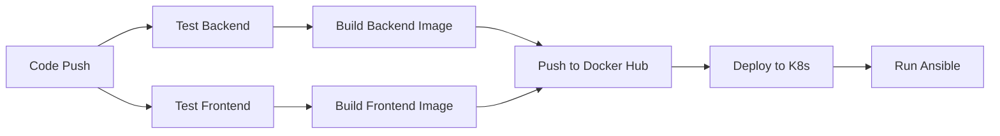

# CI/CD Setup Guide

## Overview

This project uses a comprehensive CI/CD pipeline with:
- **GitHub Actions** for automation
- **Docker Hub** for container registry
- **Kubernetes** for orchestration
- **Ansible** for configuration management

## Prerequisites Setup

### 1. Docker Hub Account

1. Sign up at [Docker Hub](https://hub.docker.com/)
2. Create an access token:
   - Go to Account Settings → Security → New Access Token
   - Name: `github-actions-cicd`
   - Permissions: Read, Write, Delete
   - Copy the token (you won't see it again!)

### 2. GitHub Repository Secrets

Navigate to your GitHub repository → Settings → Secrets and variables → Actions

Add the following secrets:

#### Required Secrets

| Secret Name | Description | How to Get |
|------------|-------------|------------|
| `DOCKER_HUB_USERNAME` | Your Docker Hub username | Your Docker Hub account name |
| `DOCKER_HUB_TOKEN` | Docker Hub access token | From Docker Hub → Account Settings → Security |
| `KUBE_CONFIG` | Base64 encoded kubeconfig | `cat ~/.kube/config \| base64` |

#### Optional Secrets (for Ansible)

| Secret Name | Description |
|------------|-------------|
| `SSH_PRIVATE_KEY` | Private SSH key for server access |

### 3. Kubernetes Cluster Setup

#### Option A: Local Development (Minikube)

```bash
# Install Minikube
curl -LO https://storage.googleapis.com/minikube/releases/latest/minikube-darwin-amd64
sudo install minikube-darwin-amd64 /usr/local/bin/minikube

# Start cluster
minikube start --cpus=4 --memory=8192

# Enable ingress
minikube addons enable ingress

# Get kubeconfig
kubectl config view --raw
```

#### Option B: Cloud Kubernetes (EKS/GKE/AKS)

**AWS EKS:**
```bash
eksctl create cluster \
  --name healthcare-cluster \
  --region us-west-2 \
  --nodegroup-name standard-workers \
  --node-type t3.medium \
  --nodes 3 \
  --nodes-min 1 \
  --nodes-max 4
```

**Google GKE:**
```bash
gcloud container clusters create healthcare-cluster \
  --num-nodes=3 \
  --machine-type=n1-standard-2 \
  --region=us-central1
```

**Azure AKS:**
```bash
az aks create \
  --resource-group healthcare-rg \
  --name healthcare-cluster \
  --node-count 3 \
  --node-vm-size Standard_D2s_v3
```

## CI/CD Pipeline Configuration

### GitHub Actions Workflow

The workflow is triggered on:
- Push to `main` branch
- Pull requests to `main`
- Manual workflow dispatch

### Pipeline Stages



### Customizing the Workflow

Edit `.github/workflows/ci-cd.yml`:

```yaml
# Change branch triggers
on:
  push:
    branches: [ main, develop, staging ]

# Change Docker image names
env:
  BACKEND_IMAGE_NAME: your-backend-name
  FRONTEND_IMAGE_NAME: your-frontend-name

# Add environment-specific deployments
deploy-staging:
  if: github.ref == 'refs/heads/develop'
  # staging deployment steps

deploy-production:
  if: github.ref == 'refs/heads/main'
  # production deployment steps
```

## Docker Configuration

### Update Docker Image Names

Replace `DOCKER_HUB_USERNAME` in files:

1. **GitHub Actions** (`.github/workflows/ci-cd.yml`):
```yaml
env:
  DOCKER_HUB_USERNAME: your_username  # Update this
```

2. **Kubernetes Manifests** (`k8s/backend-deployment.yaml`, `k8s/frontend-deployment.yaml`):
```yaml
image: your_username/healthcare-backend:latest  # Update this
```

3. **Makefile**:
```makefile
DOCKER_USERNAME ?= your_username  # Update this
```

### Test Docker Builds Locally

```bash
# Build images
make docker-build DOCKER_USERNAME=your_username

# Test locally
docker-compose up

# Push to Docker Hub
docker login
make docker-push DOCKER_USERNAME=your_username
```

## Kubernetes Configuration

### Update Secrets

**IMPORTANT**: Change default passwords before deploying to production!

Edit `k8s/secrets.yaml`:
```yaml
stringData:
  DB_USERNAME: your_db_user
  DB_PASSWORD: your_secure_password
  JWT_SECRET: your-very-long-random-jwt-secret-key
```

### Update ConfigMap

Edit `k8s/configmap.yaml`:
```yaml
data:
  CORS_ALLOWED_ORIGINS: "https://yourdomain.com,https://www.yourdomain.com"
```

### Update Ingress

Edit `k8s/ingress.yaml`:
```yaml
spec:
  tls:
  - hosts:
    - yourdomain.com  # Update with your domain
    secretName: healthcare-tls
  rules:
  - host: yourdomain.com  # Update with your domain
```

## Ansible Configuration

### Update Inventory

Edit `ansible/inventory.yml` with your server IPs:

```yaml
all:
  children:
    kubernetes:
      children:
        master:
          hosts:
            k8s-master:
              ansible_host: 1.2.3.4  # Your master node IP
        workers:
          hosts:
            k8s-worker-1:
              ansible_host: 1.2.3.5  # Your worker node IP
```

### Setup SSH Keys

```bash
# Generate SSH key
ssh-keygen -t ed25519 -C "github-actions"

# Copy to servers
ssh-copy-id -i ~/.ssh/id_ed25519.pub user@server-ip

# Add private key to GitHub Secrets
cat ~/.ssh/id_ed25519 | base64
```

## Testing the Pipeline

### 1. Manual Workflow Trigger

```bash
# Using GitHub CLI
gh workflow run ci-cd.yml

# Or via GitHub UI
# Go to Actions → CI/CD Pipeline → Run workflow
```

### 2. Test with Git Push

```bash
git add .
git commit -m "Test CI/CD pipeline"
git push origin main
```

### 3. Monitor Pipeline

```bash
# View workflow runs
gh run list

# View specific run
gh run view RUN_ID

# Watch logs
gh run watch
```

## Environment-Specific Deployments

### Development Environment

```yaml
# .github/workflows/dev.yml
name: Deploy to Development
on:
  push:
    branches: [ develop ]

jobs:
  deploy-dev:
    runs-on: ubuntu-latest
    steps:
      - uses: actions/checkout@v4
      - name: Deploy to dev cluster
        run: |
          kubectl config use-context dev-cluster
          kubectl apply -f k8s/ -n healthcare-dev
```

### Staging Environment

```yaml
# .github/workflows/staging.yml
name: Deploy to Staging
on:
  push:
    branches: [ staging ]

jobs:
  deploy-staging:
    runs-on: ubuntu-latest
    environment: staging
    steps:
      - uses: actions/checkout@v4
      - name: Deploy to staging cluster
        run: |
          kubectl config use-context staging-cluster
          kubectl apply -f k8s/ -n healthcare-staging
```

### Production Environment

```yaml
# .github/workflows/prod.yml
name: Deploy to Production
on:
  push:
    branches: [ main ]
    tags:
      - 'v*'

jobs:
  deploy-prod:
    runs-on: ubuntu-latest
    environment: production
    steps:
      - uses: actions/checkout@v4
      - name: Deploy to production cluster
        run: |
          kubectl config use-context prod-cluster
          kubectl apply -f k8s/ -n healthcare
```

## Monitoring and Alerts

### Setup Slack Notifications

Add to workflow:
```yaml
- name: Slack Notification
  uses: 8398a7/action-slack@v3
  with:
    status: ${{ job.status }}
    text: 'Deployment completed!'
    webhook_url: ${{ secrets.SLACK_WEBHOOK }}
  if: always()
```

### Setup Email Notifications

GitHub Actions automatically sends emails on workflow failures to repository watchers.

## Rollback Procedures

### Manual Rollback

```bash
# Via kubectl
kubectl rollout undo deployment/backend-deployment -n healthcare
kubectl rollout undo deployment/frontend-deployment -n healthcare

# Via Ansible
make ansible-rollback

# Via Makefile
make k8s-rollback
```

### Automated Rollback

Add to workflow:
```yaml
- name: Rollback on failure
  if: failure()
  run: |
    kubectl rollout undo deployment/backend-deployment -n healthcare
    kubectl rollout undo deployment/frontend-deployment -n healthcare
```

## Security Best Practices

1. **Secrets Management**
   - Never commit secrets to Git
   - Use GitHub Secrets for sensitive data
   - Rotate secrets regularly
   - Consider using tools like HashiCorp Vault

2. **Image Security**
   - Scan images for vulnerabilities
   - Use minimal base images (alpine)
   - Keep images updated
   - Sign images with Docker Content Trust

3. **Kubernetes Security**
   - Enable RBAC
   - Use Network Policies
   - Implement Pod Security Standards
   - Regular security audits

4. **Access Control**
   - Limit GitHub repository access
   - Use separate service accounts
   - Enable 2FA on all accounts
   - Audit access logs regularly

## Troubleshooting

### Common Issues

1. **Docker Push Failed**
   ```bash
   # Check Docker Hub credentials
   docker login
   # Verify token permissions
   ```

2. **Kubernetes Deployment Failed**
   ```bash
   # Check kubeconfig
   kubectl config view
   # Verify cluster access
   kubectl get nodes
   ```

3. **Ansible Connection Failed**
   ```bash
   # Test connectivity
   ansible -i inventory.yml all -m ping
   # Check SSH keys
   ssh -i ~/.ssh/id_rsa user@server-ip
   ```

## Next Steps

1. ✅ Setup GitHub repository secrets
2. ✅ Configure Docker Hub
3. ✅ Deploy Kubernetes cluster
4. ✅ Update configuration files
5. ✅ Test pipeline locally
6. ✅ Push to GitHub and verify
7. ✅ Setup monitoring
8. ✅ Configure alerts

## Support

For issues:
1. Check GitHub Actions logs
2. Review Kubernetes events
3. Check Docker Hub for images
4. Review this documentation
5. Create an issue in the repository

## Additional Resources

- [GitHub Actions Documentation](https://docs.github.com/en/actions)
- [Docker Documentation](https://docs.docker.com/)
- [Kubernetes Documentation](https://kubernetes.io/docs/)
- [Ansible Documentation](https://docs.ansible.com/)

